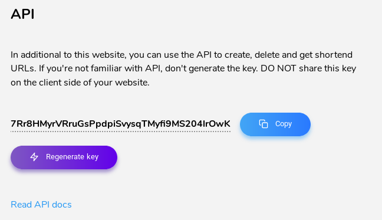
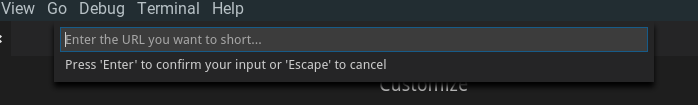

# Kutt for VSCode
[](https://marketplace.visualstudio.com/items?itemName=mehrad.kutt)
[](https://marketplace.visualstudio.com/items?itemName=mehrad.kutt)
[](https://marketplace.visualstudio.com/items?itemName=mehrad.kutt#review-details)

Short your links in your favorit editor, powerd by [Kutt](https://github.com/thedevs-network/kutt).

## Installing

Launch VS Code Quick Open (`Ctrl + P`), paste the following command, and press enter:

```bash
ext install kutt
```

Or search for `kutt` in your editor.

## How to use?

Install [the extention](https://marketplace.visualstudio.com/items?itemName=mehrad.kutt).

First sign up on [Kutt.it](https://kutt.it) and then go to [kutt.it/settings](https://kutt.it/settings) and genrate an API key.


then copy that and return to VSCode and run `kutt` command via `ctrl + shift + p`. first time it would ask you for the API key. enter it.

after that when you use `kutt` command. it'll ask you for a URL to short.



## Extension Settings
// TODO

## Release Notes

### 0.0.2
- Initial release. It now works.


## Contributors <3
If you can make a contribution to this project, **that's one small step for you but one giant leap for mankind.**
